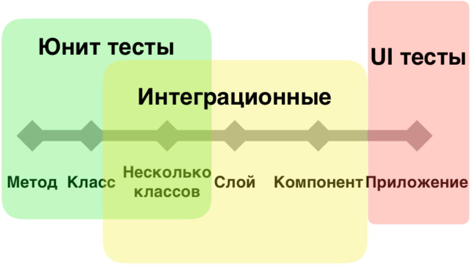

# Билет №1
## Сравнительный анализ текстового и бинарного форматов.
### Текстовый формат
__Текстовый файл__ — компьютерный файл, содержащий текстовые данные,\
как правило, организованные в виде строк.

#### Преимущества текстового формата

* __Воспринимаемость человеком__ — просто понять структуру и содержание, часто без документации и специальных инструментальных средств.
* __Простота__ — формат крайне удобен и его можно редактировать огромным количеством инструментов. И в первую очередь простым текстовым редактором.
*  __Версионируемость__ — файлы легко сравнивать, находить изменения.
*  __Переносимость__ — текстовый файл может быть прочитан на любой системе или ОС.
*  __Устойчивость__ — каждое слово и символ в таком файле самодостаточны и, если случится повреждение байтов в таком файле, то обычно можно восстановить данные или продолжить обработку остального содержимого.

В эпоху быстрых компьютеров и дешевой памяти эти преимущества побеждают.

### Бинарный формат
__Двоичный (бинарный) файл__ — в широком смысле: последовательность произвольных байтов.

#### Преимущества бинарного формата

* __Минимальный размер__ — не содержат "разметки", часто являются сжатыми.
* __Машинное представление__ данных, иногда допускает прямую (а значит быструю) загрузку в оперативную память (например сериализованные структуры данных). Нет необходимости в конверсии.
*  __Эффективность__ некоторых операций: поиск элементов, иногда вставка и удаление.

## Тестирование. Классификация тестов, критерии хорошего теста, инструменты.

### Классификация тестов: по масштабу

### Классификация тестов: по назначению

  - __Функциональные требования__
    - На задымление (smoke)

        -         Первый прогон программы (после написания или после внесения существенных изменений). Как правило, используется для определения, готова ли программа для проведения более обширного тестирования. Целью является выявление проблем «лежащих на поверхности» – тестируется чаще всего основная бизнес логика программы
    - Регрессионные (regression)
        -         Повторное тестирование после внесения изменений в программное обеспечение или в его окружение (в новой версии приложения), чтобы убедиться в том, что функции, которые работали в предыдущей версии системы, по-прежнему работают так, как ожидалось, а найденные дефекты успешно исправлены (все протестированное ранее тестируется повторно). Целью является выявление потенциальных проблем, которые могли возникнуть в результате изменений. Проверка исправления найденных ранее дефектов.
    - На точность (accuracy)
        -         Проверка корректности результатов выполнения программы.
    - Соответствие/совместимость (conformance/compliance)
        -         Проверка скомбинированных компонентов прикладной программы с целью определения корректности их совместного функционирования. Целью является выявление потенциальных проблем в совместном функционировании компонент.
    - Приемочные (acceptance)
        -         Первый и самый короткий тест, призванный проводить проверку основных элементов программного продукта и его работоспособности в целом. Проверяется основной функционал приложения. На основе результатов данного теста принимается решение о приемке версии программного продукта и продолжении тестирования текущей версии продукта более серьезными тестовыми испытаниями.
    - Функциональные (functional)
        -         Проверка соответствия продукта функциональным требованиям и спецификациям. 
  - __Нефункциональные требования__
    - На производительность (performance)
        -         Проверка скорости работы системы (время отклика, частота транзакций и другие зависящие от времени) в имитационной и реальной средах. Целью - установить реальную производительность программного продукта.
    - Стресс (stress)
        -         Является одним из разновидностей тестирования на производительность. Проверяется поведение системы при недостатке ресурсов (дискового пространства, обрывов сети и т.д.). 
    - Нагрузочные (load)
        -         Это те же тесты производительности, при которых система подвергается различным нагрузкам; при этом цель этого тестирования – оценить способность системы правильно функционировать при некотором превышении планируемых нагрузок при реальной эксплуатации (система имеет некоторый «запас прочности»). Цель - Убедиться в том, что система работает соответственно ожидаемым рабочим нагрузочным параметрам (какой предел работоспособности).
    - Качество кода (code quality)
        -         Проверка кода на соответствие стандартам написания кода, принятым внутри команды.

### Критерии хорошего теста

* Короткий (имеет чистый код)
    * Возможно быстро понять что тестируется и при каких условиях
* Сфокусированный (только один assert)
    * Позволяет мгновенно находить ошибку в коде программы при его модификации
* Быстрый
    * Выполняется за конечное время (обычно за доли секундб зависит от сложности теста)
* Автоматический
    * Не требует участия разработчика для выполнения
* Независим от порядка исполнения и окружения
    * Не использует специфические возможности компилятора/IDE/OS и т.д.
* Использует паттерн AAA: Arrange, Act, Assert
    * Общепринятый стандарт написания тестов

### Инструменты тестирования

Значительно упрощают создание и запуск unit-тестов,
позволяют придерживаться единого стиля.

* xUnit — общее обозначение для подобных фреймворков.
Бесплатно доступны для большинства языков:

* C/C++: CUnit, CPPUnit, GoogleTest
* Java: JUnit
* .NET: NUnit

Встроены в современные языки:

* D, Python, Go

#### Типичные возможности

* Удобное добавление тестов
    * Простая регистрация новых тестов
    * Набор функций-проверок (`assert`)
    * Общие инициализации и деинициализации
* Удобный запуск тестов
    * Пакетный режим
    * Возможность фильтрации тестов по именам
* Часто допускают интеграцию с IDE
* Генерация отчета в стандартном XML-формате
    * Возможность последующего автоматического анализа
    * Публикация на web-страницах проекта